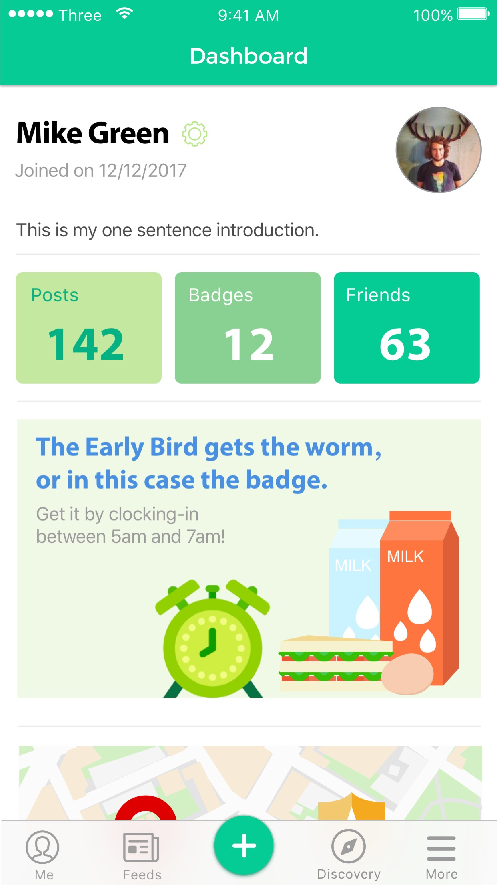
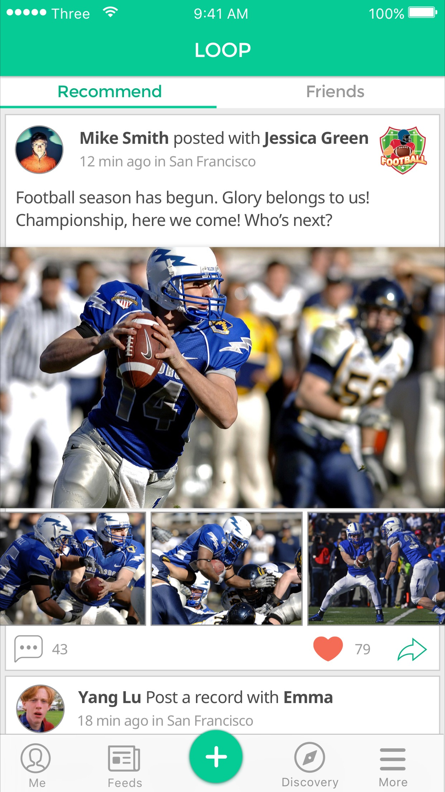
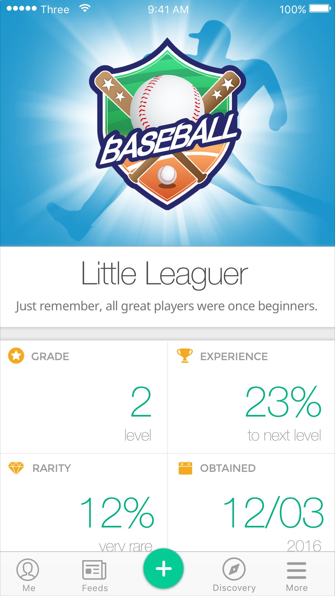
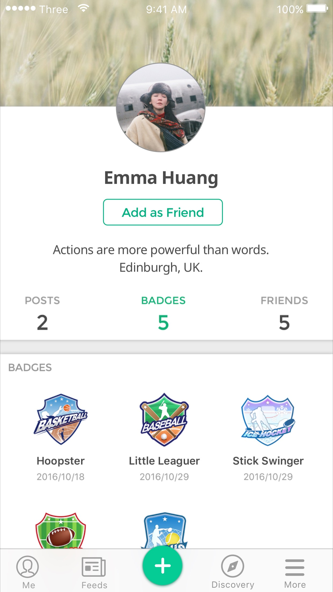
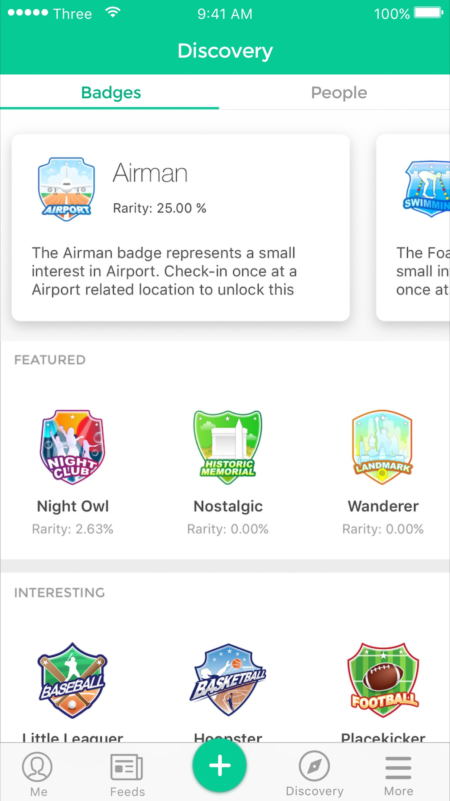
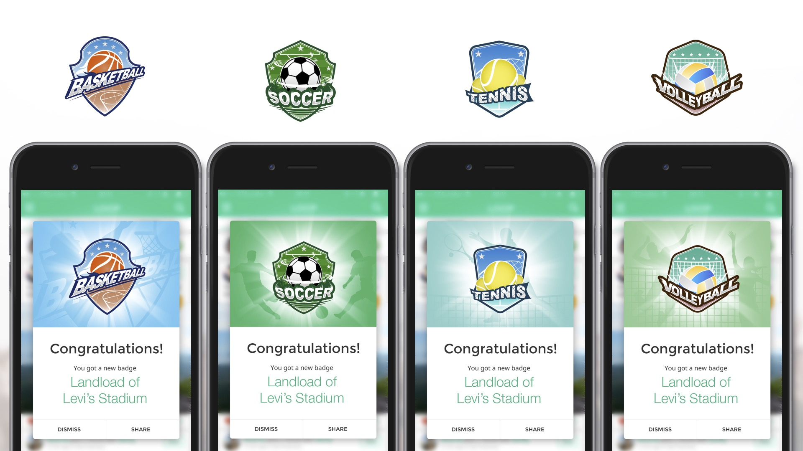

# Tomb of LOOP 📦

During my PhD, I collaborated with some friends on a project named LOOP (2016.9-2017.1). 

LOOP is a unique social platform designed to connect friends and celebrate their offline achievements through earned badges. What sets it apart from other social apps is that these badges can only be obtained through offline activities. Learn more about LOOP at [website](https://tomb-of-loop.pages.dev/). 

The LOOP app was briefly available on both the App Store and the Android store. Unfortunately, the project came to a halt before reaching 100 users due to various (dramatical) reasons. Nevertheless, I am immensely grateful for the opportunity to be part of LOOP as it provided substantial support for my PhD and enhanced my life in Edinburgh. I would like to express my deepest gratitude to Yi Zhou, who invited me to join in this project.

This repository encompasses all the resources related to LOOP, including design materials and code. Its release serves as a tribute to our collective enthusiasm and aspirations.

## Screenshots

| Screenshot 1 | Screenshot 2 |Screenshot 3| Screenshot 4|Screenshot 5|
| --- | --- | --- |--- |--- |
 |  |  |  | 

## Achievements

When achievements are unlocked through offline activities, they are displayed as badges in a dialog with a captivating background and a 5-second animation. Here are examples:

Below, you will find a comprehensive list of all the badges available in LOOP. Each badge offers three levels of achievement: Bronze, Silver, and Gold.

| Badge Title | Bronze 🥉 |Silver 🥈| Gold 🥇|
| --- | --- | --- |--- |
Museum |  |  |  
Bookstore |  |  | 
Nationalpark |  |  |  
Boxing |  |  | 
Baseball |  |  |  
Soccer |  |  |  
Football |  |  |  
Basketball |  |  |  
Billiard |  |  |  
Nightclub |  |  |  
Casino |  |  |  
Camping |  |  |  
Flight |  |  |  
Aquarium |  |  |  
Bar |  |  |  
Beach |  |  |  
Church |  |  |  
Cinema |  |  |  
Cycling |  |  |  
Golf |  |  |  
Gym |  |  |  
Historicmemorial |  |  |  
Icehockey |  |  |  
Iceskating |  |  |  
Landmark |  |  | 
Lighthouse |  |  |   
Pets |  |  |  
Rockclimbing |  |  |  
Shooting |  |  |  
Skiing |  |  |  
Surfing |  |  |  
Swimming |  |  |  
Tennis |  |  |  
Themepark |  |  |  
Volleyball |  |  |  
Winery |  |  |  
Zoo |  |  |  

## Code 
- `loop-ios`, the sourcecode of the iOS app.
- `loop-web`, the website of LOOP, visitable at [https://tomb-of-loop.pages.dev](https://tomb-of-loop.pages.dev/).

## VI & UX
Please find all files under `/assets/VI` or `/assets/UX`. Prototypes are made with [Sketch](/assets/UX/loop.sketch).

